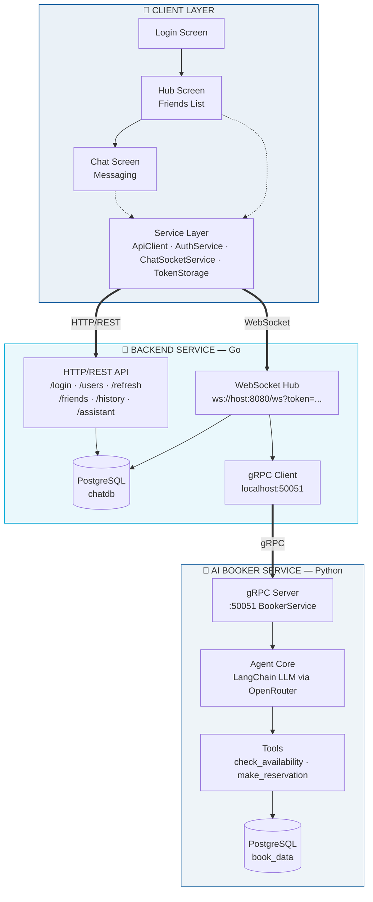
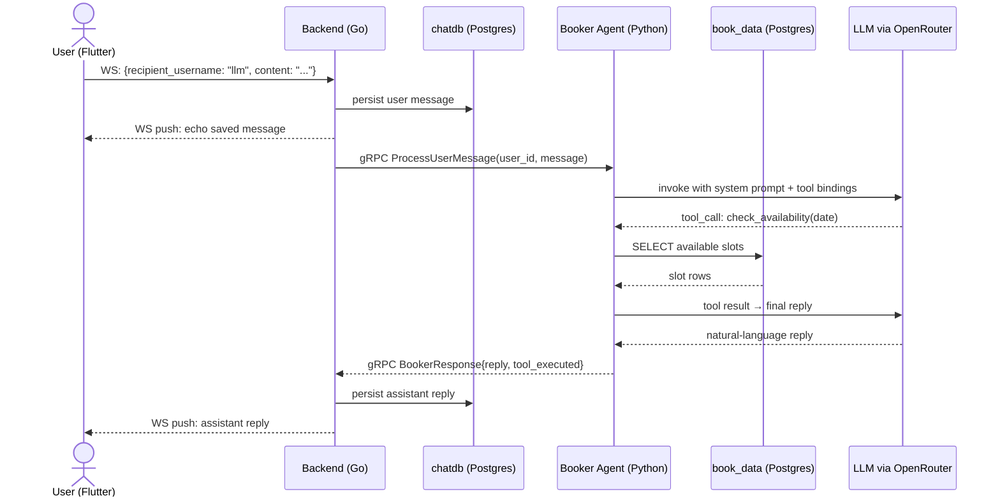

<div align="center">

# SyncPulse

**Real-time chat platform with an AI-powered booking assistant**

A distributed system split across a Flutter client, a Go WebSocket backend, and a Python/LangChain gRPC agent — talking over REST, WebSocket, and gRPC.

[](https://flutter.dev)
[](https://go.dev)
[](https://python.org)
[](https://postgresql.org)
[](https://grpc.io)
[](https://developer.mozilla.org/en-US/docs/Web/API/WebSockets_API)
[](https://langchain.com)
[](#status--known-limitations)
[](#license)

[Architecture](#architecture) · [Repositories](#repositories) · [How It Fits Together](#how-it-fits-together) · [Status](#status--known-limitations)

</div>

---

## Overview

SyncPulse is a full-stack messaging platform. Two users can DM each other in real time, and either can also DM a reserved `llm` account, which routes the conversation to an AI agent capable of checking availability and making reservations through tool calls.

It's built as three independently deployable services rather than one monolith — each with its own language, its own datastore, and its own repo:

| Layer | Repo | Stack |
|---|---|---|
| 📱 Client | [`syncpulse-flutter`](#) | Flutter/Dart, WebSocket, REST |
| 🔧 Backend | [`syncpulse-backend`](#) | Go, `net/http`, WebSocket hub, gRPC client, PostgreSQL |
| 🤖 AI Agent | [`syncpulse-booker`](#) | Python, LangChain, gRPC server, PostgreSQL |

> This repo is the **system-level entry point** — architecture, diagrams, and links to each service. Setup instructions, code, and service-specific details live in each linked repo.

---

## Architecture



**Three protocols, three trust boundaries:**

- **Client ↔ Backend (HTTP/REST):** auth, friends, history — short-lived JWT access tokens (15 min) + rotating refresh tokens (30 days).
- **Client ↔ Backend (WebSocket):** the live channel. One socket per authenticated user, held open in a hub keyed by user ID.
- **Backend ↔ Booker (gRPC):** internal, service-to-service only. The client never talks to the Booker directly — it only ever sees the `llm` user like any other friend.

---

## How It Fits Together

The interesting part isn't any single layer — it's how a message crosses all three. Here's what happens when a user DMs the `llm` assistant:



Every message — human or AI — flows through the **same** persistence and delivery path in the Go backend. The Booker service has no idea a WebSocket or a Flutter app exists; it only knows gRPC requests in, gRPC responses out. That decoupling is what let each layer be built, tested, and swapped independently.

**Conversation identity** is deterministic and computed identically on both the client and the server, so no coordination is needed to route a message:
```
conversation_id = min(userA, userB) * 1_000_000 + max(userA, userB)
```

---

## Repositories

<table>
<tr>
<td width="33%" valign="top">

### 📱 Flutter Client
State-managed with plain `setState` + `StreamController`, secure token storage, exponential-backoff WebSocket reconnection.

**[→ syncpulse-flutter](#)**

</td>
<td width="33%" valign="top">

### 🔧 Go Backend
Hexagonal layout, JWT + bcrypt auth, WebSocket hub, gRPC client to the Booker, `pgx`-backed Postgres store.

**[→ syncpulse-backend](#)**

</td>
<td width="33%" valign="top">

### 🤖 AI Booker Service
LangChain agent over OpenRouter, gRPC server, tool-calling against a live Postgres slots table.

**[→ syncpulse-booker](#)**

</td>
</tr>
</table>

> Replace the `#` links above with your actual GitHub repo URLs once each service repo is created — e.g. `https://github.com/<your-username>/syncpulse-backend`.

---

## Tech Stack at a Glance

| Concern | Choice |
|---|---|
| Mobile client | Flutter 3.x / Dart 3.x |
| Backend language | Go 1.21+ (`net/http`, no framework) |
| Agent language | Python 3.11+ |
| Client ↔ Backend | REST (auth, history, friends) + WebSocket (live messaging) |
| Backend ↔ Agent | gRPC (Protobuf) |
| Agent orchestration | LangChain, tool-calling |
| LLM provider | OpenRouter |
| Datastores | PostgreSQL ×2 (`chatdb`, `book_data`) — deliberately separate |
| Auth | JWT (HS256, 15-min access) + rotating opaque refresh tokens (30-day, SHA-256 hashed at rest) |

---

## Status & Known Limitations

This was built end-to-end in **5 days** as a portfolio / proof-of-concept project. It works — auth, real-time delivery, reconnection, and the AI booking loop have all been tested manually — but it is **not production-hardened**. Treat it as a demonstration of the architecture, not a deployment-ready system.

Known corners cut, so nothing here is a surprise later:

- WebSocket handshake accepts with `InsecureSkipVerify: true` — fine for local dev, not for a public deployment.
- JWT secret falls back to a hardcoded default if `JWT_SECRET` isn't set in the environment.
- CORS is wide open to any `localhost`/`127.0.0.1` origin — needs a real allow-list before going anywhere near production.
- The Booker agent keeps conversation history in an in-process Python dict (`SESSIONS`) — it's lost on restart and won't scale past a single instance.
- No rate limiting on message sends, login attempts, or the `/booker` REST fallback.
- The two `booker.proto` copies (Go and Python) are maintained by hand and can drift — there's no shared source of truth yet.

None of these are hard to fix — they're just out of scope for a 5-day build. Each service repo tracks its own TODOs in more detail.

---

## License

MIT — see [LICENSE](LICENSE) for details.

<div align="center">

Built by [Your Name](#) · [syncpulse-flutter](#) · [syncpulse-backend](#) · [syncpulse-booker](#)

</div>
